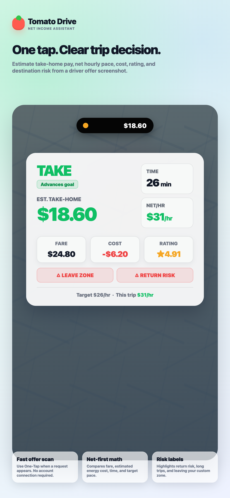
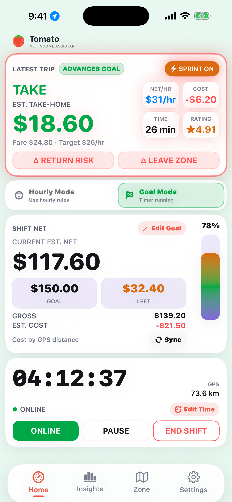
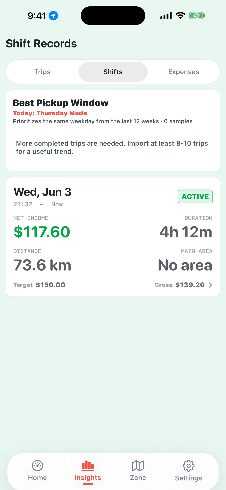
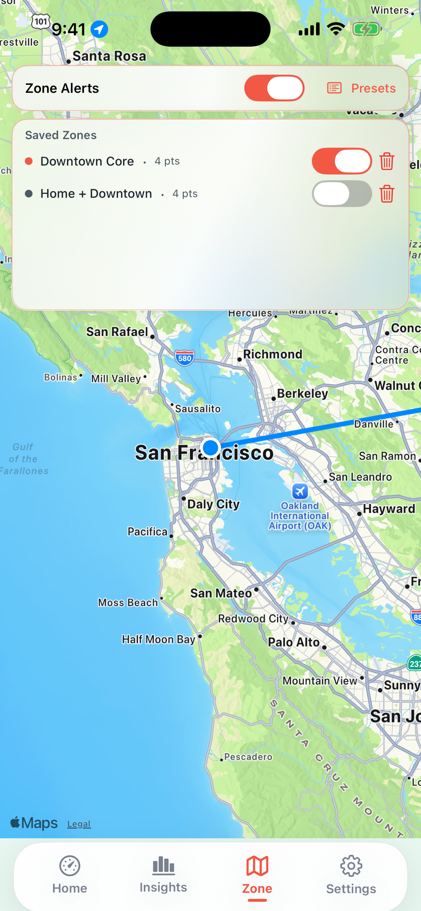
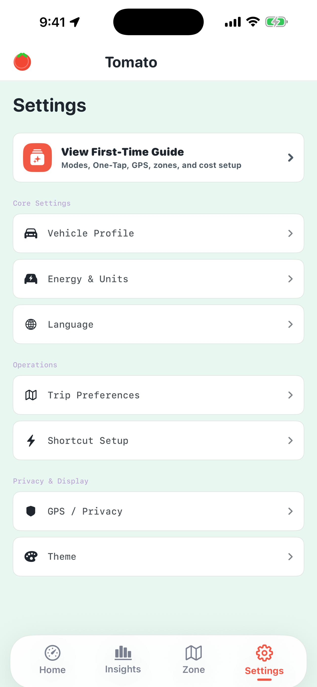

# Trip Identifier

An iOS driver assistant that reads incoming rideshare offers, estimates real take-home value, and surfaces a quick accept-or-decline recommendation before the driver commits.

> Portfolio note: this repository is a public case-study version of the project. It is intended to demonstrate product thinking, iOS implementation ability, and shipped-on-device prototyping. The full production source code and proprietary decision logic are not included.

## The Problem

Rideshare drivers often have only a few seconds to decide whether an incoming trip is worth accepting. The platform offer screen may show a large fare, but that number does not always reflect the real value of the trip.

Drivers still need to mentally account for:

- pickup time and distance
- trip duration and mileage
- estimated fuel or energy cost
- passenger rating
- destination risk, such as leaving a preferred operating area
- long return trips or low-value trips that look good at first glance

Making that calculation while driving is stressful, inconsistent, and easy to get wrong. Trip Identifier was built to make that decision faster and more data-informed.

## What It Does

- Detects visible trip-offer information from the iPhone screen.
- Uses OCR to extract fare, time, distance, rating, and trip details.
- Estimates take-home value after operating cost.
- Classifies the offer into simple driver-facing outcomes, such as strong, caution, or avoid.
- Displays the recommendation quickly through a real-time iOS interface, including Dynamic Island / Live Activity style feedback.
- Supports driver settings such as vehicle cost assumptions, operating zones, and target-based decision modes.
- Helps drivers review past trips and understand how different types of offers affected their shift.

## How It Works / Tech Stack

Trip Identifier is built as a native iOS app using Swift and Xcode.

Core technologies used:

- **Swift / SwiftUI** for the iOS application interface and state-driven UI.
- **Apple Vision** for on-device OCR, reading text from order screenshots or captured screen content.
- **ActivityKit / Live Activities** for real-time trip analysis feedback and Dynamic Island presentation.
- **CoreLocation / MapKit concepts** for location-aware trip context and operating-area logic.
- **Local persistence** for storing user preferences, vehicle assumptions, shift state, and recent analysis history.
- **Xcode device deployment** for running and testing the app on a real iPhone.

At a high level, the app flow is:

1. The driver receives or captures a rideshare offer screen.
2. Apple Vision extracts relevant text from the visible offer.
3. The app parses the recognized text into structured trip fields.
4. The decision engine estimates cost, net value, hourly pace, and risk signals.
5. The result is shown as a concise recommendation that the driver can understand quickly.

The production implementation includes additional validation, edge-case handling, and proprietary scoring logic that are intentionally not published in this portfolio repository.

## My Role

I independently designed, built, and tested this project end to end.

My work included:

- identifying the real driver workflow problem
- designing the trip-analysis product experience
- building the native iOS app in Swift
- integrating OCR through Apple Vision
- implementing real-time iOS presentation with ActivityKit
- testing the app on a physical iPhone
- iterating the UI and recommendation language based on real driving scenarios

I am not a traditional computer science graduate. I used AI coding assistants such as Codex, Cursor, and Copilot as development tools, while making the product decisions, testing the behavior, debugging issues, and guiding the final implementation myself.

This project represents my ability to turn a practical user problem into a working mobile product.

## Screenshots

The screenshots below use demo data and App Store-safe UI captures. Real trip screenshots should be cropped or redacted before being published, especially if they contain passenger details, exact pickup/drop-off addresses, earnings history, or personal account information.

### One-Tap Offer Analysis

### Shift and Net Income Dashboard

### Trip Review / Insights

### Zone Management

### Settings

## Demo Video

A short demo GIF or screen recording can be added here later. It should use demo data or redacted real-world footage.

## What This Repository Contains

This public repository is structured as a portfolio artifact. It may include:

- selected UI mockups
- design handoff documents
- screenshots or demo images
- selected non-sensitive code snippets
- product documentation
- implementation notes

It intentionally excludes:

- complete production source code
- private API keys or service identifiers
- signing certificates, provisioning profiles, and build artifacts
- proprietary parsing and scoring logic
- personal user data or real driver records

## Disclaimer

Trip Identifier is an independent project and is not affiliated with, endorsed by, or sponsored by Uber or any rideshare platform.

The app provides estimated decision support only. It does not guarantee earnings, trip availability, or platform outcomes.

## Status

The app has been built and tested on a real iPhone. The public repository is being prepared as a professional portfolio case study rather than a full open-source release.
